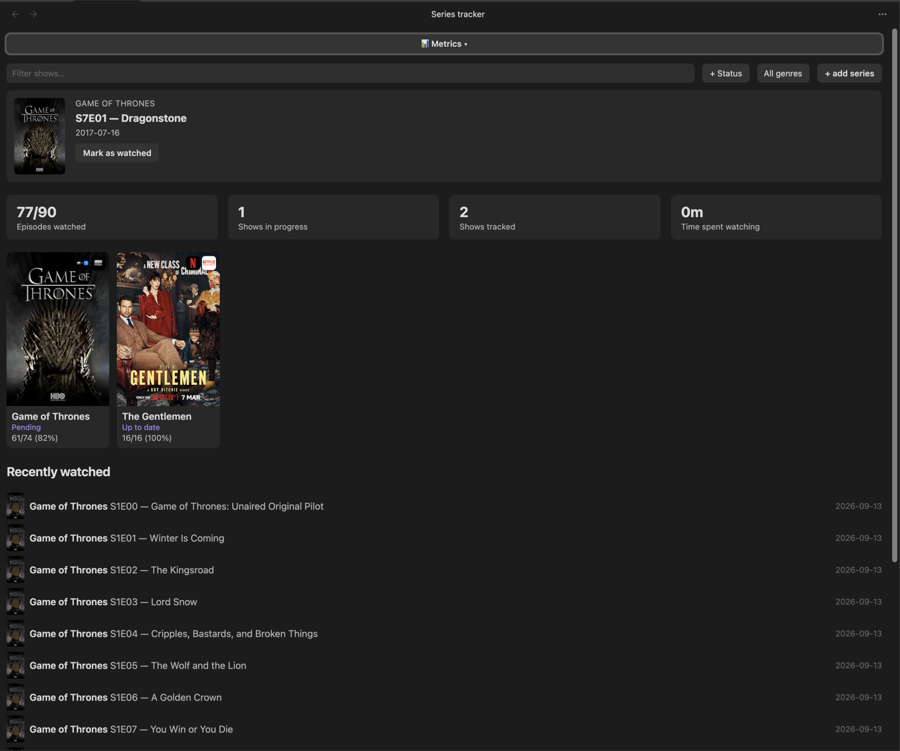
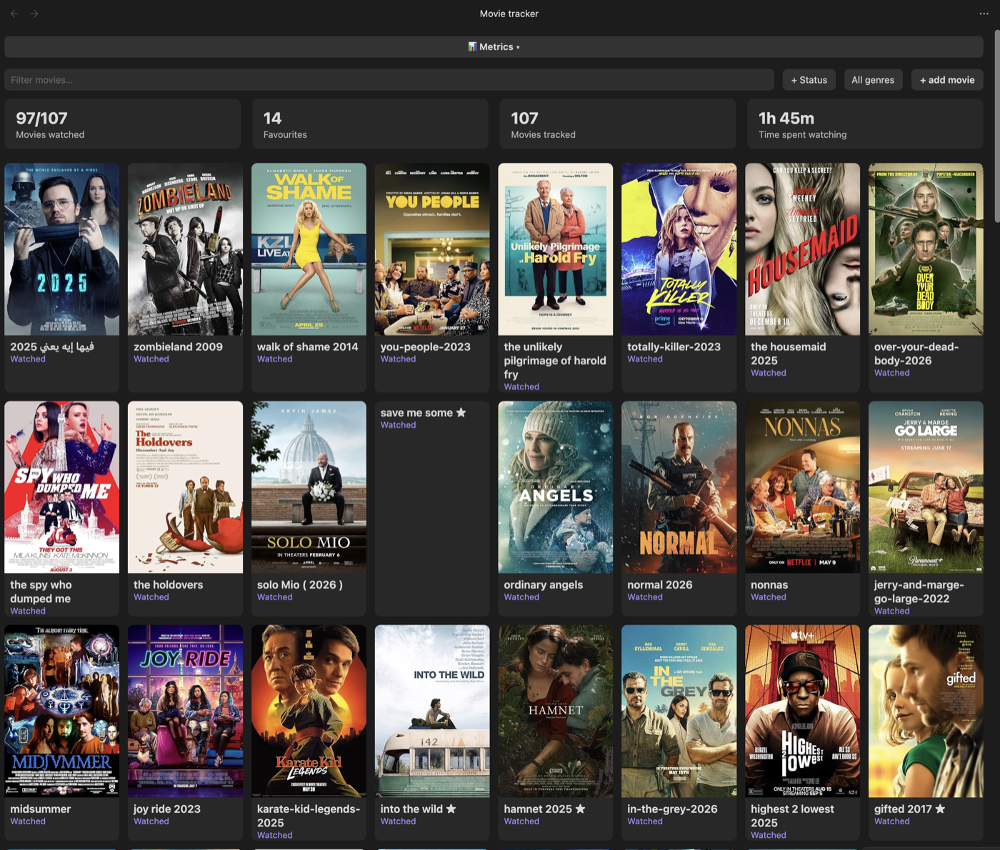

<p align="center"></p>

# Series Tracker

[](https://github.com/ahmedesa/obsidian-series-tracker/actions/workflows/ci.yml)
[](https://github.com/ahmedesa/obsidian-series-tracker/releases/latest)
[](LICENSE)

An Obsidian plugin: a TrackSeries-style dashboard for TV series (episode
checklists, air-date awareness, automatic status) and movies (watchlist
grid, ratings, favourites) — reading and writing plain Markdown notes,
never owning your data.

## Screenshots

**Series dashboard** — filters, stats, "Next Up" spotlight, poster grid, recently watched feed



**Movies dashboard** — filters, stats, favourites, streaming-provider badges on posters



## Features

**Series**
- Dashboard: poster grid, text + status + genre filters, a sort control
  (last edited / title / recently added / rating / status / recently
  watched — defaults to last edited), stats (episodes watched, shows in
  progress, shows tracked, favourites, time spent watching)
- "Next Up" spotlight (oldest aired-but-unwatched episode across all
  tracked shows) and an "Upcoming" list grouped by air date
- "Recently watched" feed
- Per-show detail view: season/episode checklists, per-episode watched-date
  stamps, "Mark season as watched", a "Refresh from TMDb" button that pulls
  in newly-aired episodes without touching your existing watch state
- Automatic status (Wishlist / Pending / Up to date / Completed), derived
  from watch state and air dates — "Abandoned" is the one status you set
  yourself and the plugin never overwrites
- Personal 0–5 rating (half-star increments), favourite toggle, a "Mood"
  tag, an editable completion date, and a freeform Notes section per show
- Delete a show from the detail view (moves the note to Obsidian's trash,
  never a hard delete)

**Movies**
- Dashboard: poster grid, text + status + genre filters, a sort control
  (last edited / title / recently added / rating / status / recently
  watched — defaults to last edited), stats (movies watched, favourites,
  movies tracked, time spent watching)
- Add via TMDb search (poster, genre, plot, etc. filled in automatically)
- Personal 0–5 rating (half-star increments), favourite toggle, status
  (Want to Watch / Watching / Watched), a "Mood" tag, an editable
  completion date, Notes section
- Delete a movie from the detail view (same trash-not-hard-delete behavior)

**Both sections**
- Streaming-provider badges on poster cards (which service it's on,
  configurable by country)
- A "Recommended for you" strip on both dashboards, built from your own
  top-rated genres — hidden entirely until you've rated something
- A collapsible "Metrics" panel on both dashboards: top genres, total
  viewing time, and a taste-index comparing your ratings to TMDb's public
  average — computed on demand, not on every render
- Can't find a title by name (e.g. searching in a non-English language)?
  Add it directly by IMDb ID or URL instead — bypasses search entirely

Both sections search and fetch metadata from the free
[TMDb API](https://www.themoviedb.org/settings/api) — you'll need your own
key. TMDb was chosen over OMDb specifically because it indexes translated
titles, so searching in a non-English language (e.g. Arabic) actually finds
results — OMDb only matches a title's single primary (usually English)
listing. Notes still store an IMDb URL in `source_url` for portability; the
plugin resolves that to TMDb's internal id automatically whenever it needs
to fetch data (via TMDb's `find` endpoint, cached permanently once resolved).

## Install

1. In Obsidian: Settings → Community plugins → Browse → search
   "Series Tracker" → Install → Enable.
2. Get a free TMDb API key and set it in Settings → Series Tracker:
   1. Go to [themoviedb.org](https://www.themoviedb.org/) and create a
      free account (or sign in).
   2. Go to [themoviedb.org/settings/api](https://www.themoviedb.org/settings/api)
      and request an API key (choose "Developer" — it's free, approval is
      instant).
   3. Copy the **API Key (v3 auth)** value.
   4. In Obsidian: Settings → Series Tracker → paste it into the
      **TMDb API key** field.
3. Set your series folder and movies folder in Settings → Series Tracker
   (defaults: `Media/Series`, `Media/Movies`).

## Note format

### Series

The dashboard only picks up notes under the configured series folder
(default `Media/Series/`) whose frontmatter includes `type: series` — any
note missing that field is silently skipped.

```markdown
---
type: series
title: Example Show
status: watching
rating: 4
favourite: false
total_seasons: 2
source: manual
source_url: https://www.imdb.com/title/tt0000000/
tags: [Drama]
date_added: 2026-09-13
date_completed: ""
mood: ""
image: https://example.com/poster.jpg
---

## Season 1
- [x] E1 — Pilot (watched: 2026-09-13)
- [ ] E2 — Second Episode

## Season 2
- [ ] E1 — Season Opener

## Notes
```

- `type` (required) — must be exactly `series`.
- `status` — one of `want-to-watch` / `watching` / `up-to-date` / `finished`
  / `abandoned`. The first four are auto-managed from watch state; only
  `abandoned` is a pure manual choice the plugin never overwrites.
- `rating` — `0`–`5` or `null`.
- `source_url` — an IMDb title URL. When present, its IMDb id is resolved to
  a TMDb id (cached) and used to fetch season/episode air dates and series
  metadata from TMDb.
- `image` — poster URL, must be an **absolute URL**.
- `favourite` — `true`/`false`, toggleable in the detail view.
- `date_completed` — auto-stamped when status reaches `finished`, cleared if
  it moves away; editable in the detail view ("Completed on") to correct or
  backdate it.
- `mood` — a short curated "how did this make you feel" tag, editable in the
  detail view: `Feel-Good` / `Uplifting` / `Intense` / `Suspenseful` / `Sad`
  / `Relaxing` / `Thought-Provoking` / `Dark`, or empty for unset.
- Each season starts with a `## Season N` heading; episodes are Markdown
  task items directly under it, `- [ ] E<number> — <title>`. Checking a box
  in the plugin's detail view stamps `(watched: YYYY-MM-DD)` onto the line
  and rewrites that exact line in the note — nothing else in the file is
  touched.
- A `## Notes` heading (anywhere in the body) holds freeform text, editable
  from the detail view.

### Movies

Notes under the configured movies folder (default `Media/Movies/`) with
`type: movie` frontmatter:

```markdown
---
type: movie
title: "Example Movie"
status: want-to-watch
source: manual
source_url: ""
genre: ["Action", "Drama"]
language: ""
favourite: false
rating: null
tags: ["Action", "Drama"]
date_added: 2026-09-13
date_completed: ""
mood: ""
image: ""
---

# Example Movie
```

- `status` — one of `want-to-watch` / `watching` / `watched`. Setting it to
  `watched` from the detail view stamps `date_completed`; editable there
  ("Completed on") to correct or backdate it.
- `favourite`, `rating` (`0`–`5` or `null`), `genre`/`tags` — same
  conventions as series.
- `mood` — same short curated tag as series (see above), editable in the
  detail view.

## Development

`npm run dev` starts esbuild in watch mode — re-copy `main.js` into the
vault's plugin folder after each change (or symlink it) and reload Obsidian
(Cmd+P → "Reload app without saving") to see changes.

`npm test` runs the unit test suite (vitest). `npm run build` type-checks
(`tsc -noEmit`) before bundling. `npm run lint` runs the same
[eslint-plugin-obsidianmd](https://www.npmjs.com/package/eslint-plugin-obsidianmd)
rules community.obsidian.md's plugin review checks, so issues surface
locally before a push instead of on the review page. All three must pass
before a commit.

## License

MIT — see [LICENSE](LICENSE).
